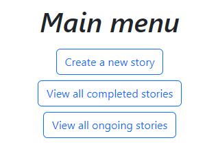
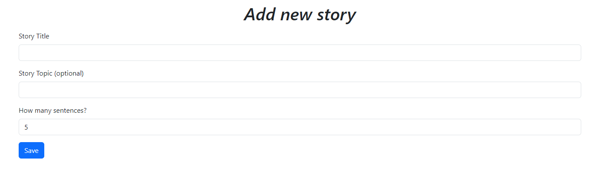
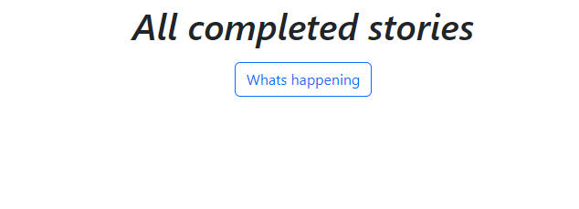
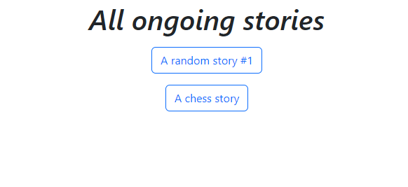
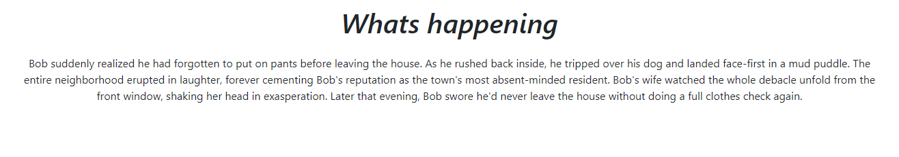

# StoryGameWeb

For the web api follow [this](https://github.com/Tnail1994/StoryGameApi)

An Angular Web Application. The Game called 'One Line Story'.
"One Line Story" is a collaborative storytelling game where participants wor together to create a narrative, one sentence at a time. The game begins With a starting sentence, and each Player, in turn, contributes one sentence to the story while only seeing the preceding sentence. This sequential process continues, With each player building on the emerging plot or introducing unexpected twists. The result is a unique and often humorous story that unfolds gradually, showcasing the creativity and adaptability of the participants as they respond to the evolving narrative in real-time. The game is a playful exercise in cooperative storytelling, demonstrating how a  ollective imagination can Shape a story in unexpected ways.

## Screenshots

Main menu view: Navigating to `CreateStory` or `StoryListComponent`

Create story view: Service sends put request, when form is valid

Story lists view: Service sends get request for completed or ongoing stories

Story details lists view: Service sends get and put request for getting story info and updating sentences

